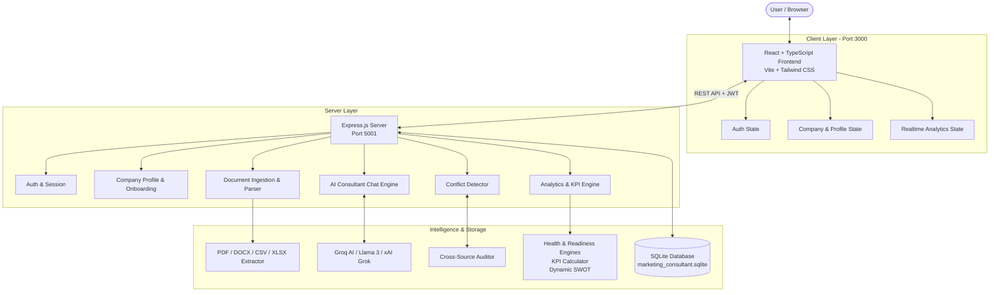

# AI Marketing Consultant 🚀

[](https://www.typescriptlang.org/)
[](https://reactjs.org/)
[](https://vitejs.dev/)
[](https://nodejs.org/)
[](https://expressjs.com/)
[](https://tailwindcss.com/)
[](https://groq.com/)
[](LICENSE)

> An autonomous, data-driven **AI Marketing Consultant** designed for startups, scale-ups, and modern enterprises. Ingests business documents, interviews founders via interactive chat, resolves data contradictions, calculates actionable unit economics, and crafts board-ready growth strategies.

---

## 📌 Table of Contents

- [Overview](#-overview)
- [Key Features](#-key-features)
- [System Architecture](#-system-architecture)
- [Tech Stack](#-tech-stack)
- [Project Structure](#-project-structure)
- [Getting Started](#-getting-started)
  - [Prerequisites](#prerequisites)
  - [Installation](#installation)
  - [Environment Configuration](#environment-configuration)
  - [Running Locally](#running-locally)
- [Analytics & Scoring Engine](#-analytics--scoring-engine)
- [API Reference](#-api-reference)
- [Database Schema](#-database-schema)
- [Roadmap](#-roadmap)
- [Contributing](#-contributing)
- [License](#-license)

---

## 🌟 Overview

Hiring traditional growth and marketing consultants often costs thousands of dollars, requires weeks of scheduling, and produces static PDFs that quickly become obsolete. 

**AI Marketing Consultant** provides a high-velocity, automated alternative:
1. **Interactive Onboarding & Discovery**: Engages founders and marketers through intuitive conversation and multi-step onboarding to capture core business identity, targets, and goals.
2. **Multi-Source Document Ingestion**: Parses pitch decks, financial sheets, and business plans (PDF, DOCX, CSV, XLSX) into structured knowledge.
3. **Data Conflict Resolution**: Automatically identifies when uploaded documents contradict chat statements (e.g. conflicting CAC or pricing data) and prompts for resolution.
4. **Deterministic & AI Analytics Engine**: Computes verifiable unit economics (LTV, CAC, Payback, Churn) and calculates composite **Business Health** and **Marketing Readiness** scores.
5. **Dynamic Action Plans & Executive Reports**: Generates tailored SWOT matrices, positioning maps, channel budget splits, and downloadable executive growth briefs.

---

## ✨ Key Features

### 💬 AI Discovery & Consultant Chat
- Context-aware conversation powered by Groq ultra-fast inference (`llama-3.3-70b-versatile` / `mixtral-8x7b-32768`) and xAI Grok fallback.
- Dynamic entity extraction directly from dialogue into the structured company profile.
- Context retention across sessions with conversational history management.

### 📊 Strategic Analytics & KPI Engine
- **Business Health Score (0–100)**: Evaluates 4 pillars: Market Opportunity, Financial Viability, Customer Acquisition Efficiency, and Product-Market Fit.
- **Marketing Readiness Score (0–100)**: Measures analytics setup, attribution maturity, asset availability, and budget readiness.
- **Growth Potential Index**: Categorizes trajectory (`Low`, `Moderate`, `High`, `Exponential`) with actionable bottlenecks highlighted.
- **Dynamic SWOT Analysis**: Derives real-time Strengths, Weaknesses, Opportunities, and Threats mapped with confidence levels and source provenance.
- **Unit Economics Engine**: Calculates:
  - Customer Acquisition Cost (CAC)
  - Customer Lifetime Value (LTV)
  - LTV-to-CAC Ratio & Benchmarks
  - Payback Period & Gross Margins
  - ROAS (Return on Ad Spend) & Funnel Drop-off Rates
- **Buyer Persona Synthesis**: Automatically crafts detailed target personas with specific pain points, objections, and optimal acquisition channels.
- **Market Positioning Matrix**: Compares quality, pricing, and defensibility against named competitors.
- **Channel Budget Allocator**: Generates data-backed percentage splits across Organic Search, Paid Acquisition, Content Marketing, and Outbound.

### ⚖️ Cross-Source Data Conflict Detection
- Compares claims extracted across disparate sources (e.g., chat answers vs. uploaded financial models).
- Flags inconsistencies (e.g., revenue mismatch, target demographic conflicts) with severity rankings.
- Interactive resolution modal allowing users to pick the accurate data point or input a corrected value.

### 📂 Multi-Format Document Ingestion
- Native support for:
  - **PDF** documents (`pdf-parse`)
  - **Word / DOCX** files (`mammoth`)
  - **Excel / Spreadsheets** (`xlsx`)
  - **CSV** data tables (`csv-parse`)
- Automatic text extraction, summarization, and key insight indexing.

### 📑 Executive Growth Reports
- Consolidated report summarizing market posture, critical KPIs, risk vectors, and 30-60-90 day tactical recommendations.
- Print-ready and exportable for stakeholders, board members, and investors.

---

## 🏗 System Architecture



---

## 💻 Tech Stack

### Frontend
- **Framework**: [React 18](https://reactjs.org/) with [TypeScript](https://www.typescriptlang.org/)
- **Bundler & Tooling**: [Vite 5](https://vitejs.dev/)
- **Styling**: [Tailwind CSS 3](https://tailwindcss.com/)
- **Icons**: [Lucide React](https://lucide.dev/)
- **Charts & Visualizations**: [Recharts](https://recharts.org/)
- **Routing**: [React Router v6](https://reactrouter.com/)

### Backend
- **Runtime**: [Node.js](https://nodejs.org/) (v18+)
- **Web Framework**: [Express.js](https://expressjs.com/) with TypeScript
- **Database**: [SQLite](https://www.sqlite.org/) via `sqlite3`
- **Authentication**: JWT (`jsonwebtoken`) & `bcryptjs`
- **Security**: `helmet`, `cors`, input sanitization
- **File Uploads**: `multer`

### AI & Data Extraction
- **LLM Provider**: [Groq SDK](https://github.com/groq/groq-typescript) (Llama 3.3 70B, Mixtral 8x7B) with optional xAI Grok API
- **Document Extractors**:
  - `pdf-parse` (PDF)
  - `mammoth` (DOCX / Word)
  - `xlsx` (Excel)
  - `csv-parse` (CSV)

---

## 📁 Project Structure

```
MARKETING_CONSULTANT/
├── client/                     # Frontend Application (React + Vite)
│   ├── public/                 # Static assets
│   ├── src/
│   │   ├── components/         # Reusable UI components & layouts
│   │   │   ├── layout/         # Header, Sidebar, PageContainer
│   │   │   └── ui/             # Badges, Modals, Cards, Buttons
│   │   ├── context/            # React Context providers (Auth, Company, Analytics)
│   │   ├── pages/              # Primary route views
│   │   │   ├── AIConsultantPage.tsx
│   │   │   ├── AuthPage.tsx
│   │   │   ├── DashboardPage.tsx
│   │   │   ├── DocumentsPage.tsx
│   │   │   ├── ExecutiveReportPage.tsx
│   │   │   ├── OnboardingPage.tsx
│   │   │   ├── ProfilePage.tsx
│   │   │   ├── RecommendationsPage.tsx
│   │   │   └── SettingsPage.tsx
│   │   ├── services/           # Axios / Fetch API client
│   │   ├── App.tsx             # Root routing & route guards
│   │   └── main.tsx            # App entry point
│   ├── package.json
│   ├── tailwind.config.js
│   └── vite.config.ts
│
├── server/                     # Backend API Server (Node + Express)
│   ├── src/
│   │   ├── ai/                 # Groq / xAI client, prompts & JSON parsers
│   │   ├── analytics/          # Health score, readiness score, SWOT, KPI engines
│   │   ├── auth/               # Password hashing & JWT verification
│   │   ├── db/                 # SQLite connection & schema initialization
│   │   ├── documents/          # Multi-format document parser
│   │   ├── middleware/         # Auth verification middleware
│   │   ├── routes/             # Express API route handlers
│   │   │   ├── analytics.ts
│   │   │   ├── auth.ts
│   │   │   ├── chat.ts
│   │   │   ├── company.ts
│   │   │   ├── conflicts.ts
│   │   │   ├── documents.ts
│   │   │   └── profile.ts
│   │   ├── services/           # Profile & company business logic
│   │   ├── utils/              # ID generation & helpers
│   │   └── server.ts           # Express server entry point
│   ├── .env.example            # Environment variables template
│   ├── package.json
│   └── tsconfig.json
│
├── database/                   # SQLite schema & migrations
│   └── schema.sql              # Relational SQL schema definitions
│
├── shared/                     # Shared TypeScript models & types
│   └── types/
│       └── index.ts            # Interfaces for Company, Metrics, SWOT, KPIs
│
├── uploads/                    # Temporary uploaded document store
├── package.json                # Root orchestration package.json
└── README.md                   # Project documentation
```

---

## 🚀 Getting Started

### Prerequisites
- **Node.js**: v18.0.0 or later ([Download Node.js](https://nodejs.org/))
- **npm**: v9.0.0 or later
- **Groq API Key**: Obtain a free API key at [console.groq.com](https://console.groq.com)

---

### Installation

1. **Clone the repository**:
   ```bash
   git clone https://github.com/Saiprasad002/MARKETING_CONSULTANT.git
   cd MARKETING_CONSULTANT
   ```

2. **Install root dependencies**:
   ```bash
   npm install
   ```

3. **Install server dependencies**:
   ```bash
   cd server
   npm install
   cd ..
   ```

4. **Install client dependencies**:
   ```bash
   cd client
   npm install
   cd ..
   ```

---

### Environment Configuration

Create a `.env` file in the `server/` directory:

```bash
cp server/.env.example server/.env
```

Edit `server/.env` with your preferred credentials:

```env
# Server Port
PORT=5001
NODE_ENV=development

# Authentication
JWT_SECRET=your_super_secret_jwt_key_here

# Groq AI Key (Required for AI features)
GROQ_API_KEY=gsk_your_groq_api_key_here
GROQ_MODEL=llama-3.3-70b-versatile

# Database File Path
DATABASE_PATH=../database/marketing_consultant.sqlite
```

---

### Running Locally

You can launch both the backend server and frontend client in separate terminals:

#### Terminal 1 — Backend Server:
```bash
npm run dev:server
```
*Server will initialize SQLite tables and listen on `http://localhost:5001`.*

#### Terminal 2 — Frontend Client:
```bash
npm run dev:client
```
*Client will boot Vite dev server at `http://localhost:3000` (with automated `/api` proxy to port 5001).*

Open your browser and navigate to:
```
http://localhost:3000
```

---

## 🧮 Analytics & Scoring Engine

The platform combines deterministic mathematical formulas with LLM intelligence to avoid hallucinations:

| Metric / Score | Range | Calculation Methodology |
| :--- | :---: | :--- |
| **Business Health Score** | `0 - 100` | Weighted combination of 4 dimensions: Market Position (25%), Financial Stability (30%), Customer Acquisition Efficiency (25%), and Brand / Retention Strength (20%). |
| **Marketing Readiness Score** | `0 - 100` | Audits readiness for paid growth: Value Proposition Clarity (20%), Analytics Tracking (20%), CAC/LTV Trackability (25%), Target Segment Definition (20%), and Budget Size (15%). |
| **LTV : CAC Ratio** | Ratio (`x:1`) | Computed as `Customer Lifetime Value / Customer Acquisition Cost`. Evaluated against the 3:1 healthy SaaS/startup benchmark. |
| **Payback Period** | Months | `CAC / (Monthly ARPU * Gross Margin %)`. Highlights cash flow runway vulnerability. |
| **Growth Potential** | Categorical | Evaluated across unit economics viability, total addressable market sizing, and scalable channel readiness (`Low`, `Moderate`, `High`, `Exponential`). |

---

## 🔌 API Reference

### Authentication (`/api/auth`)
| Method | Endpoint | Description |
| :--- | :--- | :--- |
| `POST` | `/api/auth/register` | Register a new user and initialize company & workspace |
| `POST` | `/api/auth/login` | Authenticate credentials and receive JWT |
| `GET` | `/api/auth/me` | Fetch currently authenticated user session |
| `POST` | `/api/auth/logout` | Clear user session |

### Company & Profile (`/api/company`, `/api/profile`)
| Method | Endpoint | Description |
| :--- | :--- | :--- |
| `GET` | `/api/company` | Retrieve company organizational data |
| `PATCH`| `/api/company` | Update core company metadata |
| `GET` | `/api/profile` | Retrieve full company profile with field provenance |
| `POST` | `/api/profile/complete-onboarding` | Mark initial onboarding wizard as completed |
| `PATCH`| `/api/profile/field` | Update an individual profile field with confidence score |
| `POST` | `/api/profile/batch` | Bulk update multiple profile fields |

### AI Consultant Chat (`/api/chat`)
| Method | Endpoint | Description |
| :--- | :--- | :--- |
| `GET` | `/api/chat/messages` | Retrieve conversation history for active workspace |
| `POST` | `/api/chat/message` | Send message to AI consultant with live entity extraction |
| `POST` | `/api/chat/analytics`| Query specific analytics and metrics via conversational AI |
| `POST` | `/api/chat/reset` | Reset conversational context |

### Documents (`/api/documents`)
| Method | Endpoint | Description |
| :--- | :--- | :--- |
| `GET` | `/api/documents` | List uploaded company documents |
| `POST` | `/api/documents` | Upload document file (multipart/form-data) |
| `POST` | `/api/documents/:id/process` | Trigger text extraction and entity recognition |
| `GET` | `/api/documents/:id/insights`| Fetch AI-extracted insights and KPIs from document |
| `DELETE`| `/api/documents/:id` | Delete uploaded document |

### Analytics & Reports (`/api/analytics`, `/api/conflicts`)
| Method | Endpoint | Description |
| :--- | :--- | :--- |
| `GET` | `/api/analytics` | Fetch real-time health score, readiness score, SWOT & KPIs |
| `POST` | `/api/analytics/recalculate` | Force recalculation and capture historical snapshot |
| `GET` | `/api/analytics/history` | Retrieve historical snapshots for trend charts |
| `GET` | `/api/analytics/report` | Generate full executive growth report |
| `GET` | `/api/conflicts` | List detected cross-source data discrepancies |
| `POST` | `/api/conflicts/:id/resolve` | Resolve conflict with preferred value |

---

## 🗄 Database Schema

The SQLite schema (`database/schema.sql`) implements relational modeling with source attribution:

- **`users`**: Account identity, hashed passwords, onboarding progress.
- **`companies`**: Organization metadata, industry, stage, employee band.
- **`workspaces`**: Team partitions tied to companies.
- **`company_profiles`**: Key-value store tracking field values, confidence scores (`0.0` to `1.0`), provenance sources (`user_chat`, `uploaded_document`, `manual_edit`), and verification status.
- **`company_metrics`**: Unit economics and KPI history with calculation status (`AVAILABLE`, `CALCULATED`, `ESTIMATED`, `INSUFFICIENT_DATA`).
- **`customers`**: Buyer persona archetypes with pain points and buying behaviors.
- **`competitors`**: Competitive intelligence records with pricing and differentiation points.
- **`channels`**: Marketing channels, spend, CAC, and ROI.
- **`chat_messages`**: Chat transcripts between user and AI Consultant.
- **`documents`**: Ingested files, mime types, and parsing status.
- **`data_conflicts`**: Discrepancies between sources awaiting resolution.
- **`analytics_snapshots`**: Time-series snapshots of scores and recommendations.

---

## 🗺 Roadmap

- [x] Groq LLM integration with dynamic entity extraction
- [x] Multi-format document parser (PDF, DOCX, CSV, XLSX)
- [x] Cross-source conflict detection and resolution workflow
- [x] Deterministic Business Health & Marketing Readiness scoring engines
- [x] Dynamic SWOT, Buyer Personas, and Competitor Positioning matrix
- [ ] Direct Ad Account Connectors (Google Ads, Meta Ads API)
- [ ] CRM Integrations (HubSpot, Salesforce)
- [ ] Automated weekly AI growth digest via Slack / Email
- [ ] PDF download export for Executive Report

---

## 🤝 Contributing

Contributions, issues, and feature requests are welcome!

1. Fork the Project
2. Create your Feature Branch (`git checkout -b feature/AmazingFeature`)
3. Commit your Changes (`git commit -m 'Add some AmazingFeature'`)
4. Push to the Branch (`git push origin feature/AmazingFeature`)
5. Open a Pull Request

---

## 📄 License

Distributed under the **ISC License**. See `LICENSE` for more information.

---

<p align="center">
  Built with ❤️ for startups, founders, and marketers looking to scale efficiently.
</p>
